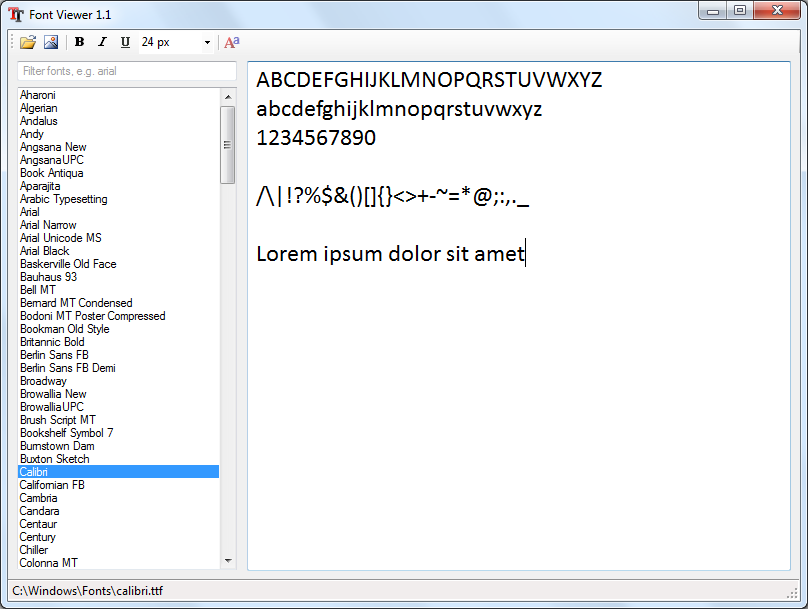

# Windows Font Viewer

Note: this project moved from https://fontviewer.codeplex.com/

## Project Description
Simple font viewer with interactive editor. Can load fonts from a directory, i.e. before installing fonts to the system.

Source code written in pure .NET 2.0 which builds into a lightweight .exe file.

## Screenshot


## Keyboard Shortcuts
```
CTRL+F - find
CTRL+E - editor
CTRL+B - toggle bold
CTRL+I - toggle italic
CTRL+U - toggle underline
CTRL++ - increase font size
CTRL+- - decrease font size
CTRL+O - open folder dialog, load fonts from directory
CTRL+S - save image containing all listed fonts, for comparison
```